# 🦩 鹈鹕监工（Pelican Nanny）

菜单栏常驻的久坐监工小窗：你坐着，它就掉血；你起来休息，它就回血；
休息时偷摸动电脑——被抓包。老朋友鹈鹕（`pelican-ride.html` 那只）出山当监工，
十二生肖也能上岗，菜单栏「🐾 换宠物」一键切换。

## 监工阵容（13 位）

| | | | |
|:---:|:---:|:---:|:---:|
| 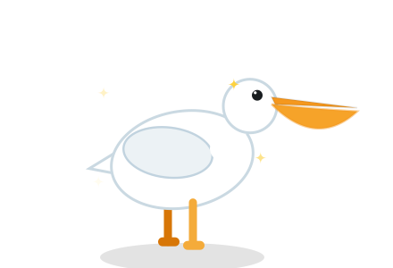<br>🦩 鹈鹕 · 老朋友 | 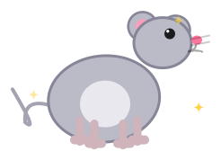<br>🐀 小老鼠 | 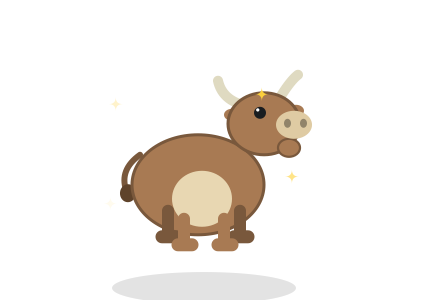<br>🐂 小牛 | 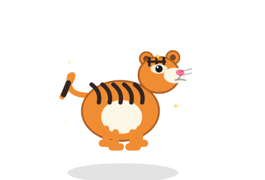<br>🐯 小老虎 |
| 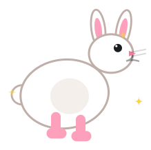<br>🐰 小兔子 | 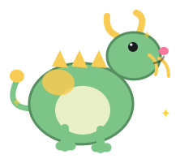<br>🐉 小青龙 | 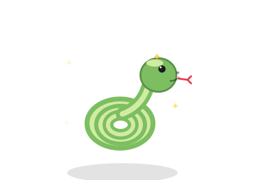<br>🐍 小蛇 | 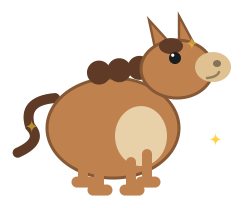<br>🐴 小马 |
| 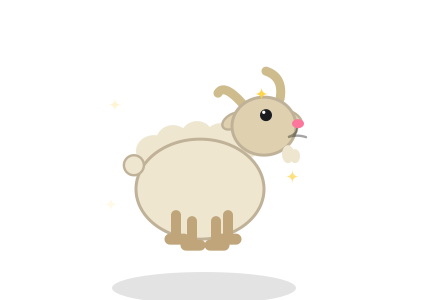<br>🐐 小羊 | 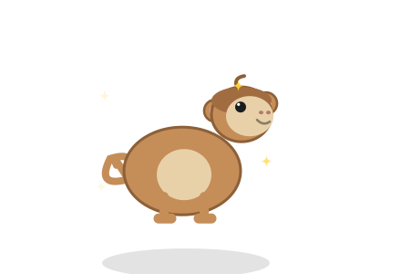<br>🐵 小猴子 | 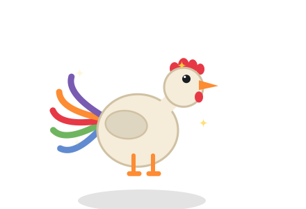<br>🐓 小鸡 | 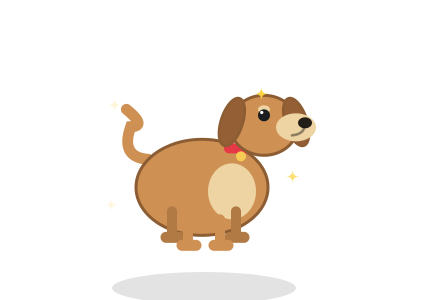<br>🐶 小狗 |
| 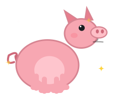<br>🐷 小猪 | | | |

> 图片即游戏内真实画风（代码绘制、离屏渲染）；换宠物后小窗会画对应那位。
> 重新生成：菜单栏「📸 保存姿势截图」或启动参数 `--shots`。

## 实际运行效果

真实小窗 UI（示例数据：正常状态 HP 68、已坐 23 分钟）：

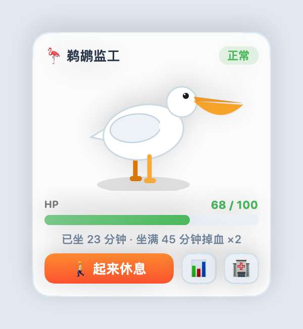

> 由真实 `PanelCard` 视图离屏渲染（`--shots` 生成 `card.png`），非手画示意图。

## 运行

```bash
cd ~/PelicanNanny
bash build.sh          # 合成音效 + swiftc 编译 + 组装 .app + ad-hoc 签名
open build/PelicanNanny.app
```

构建产物：`build/PelicanNanny.app`（自包含，可拷到 `~/Applications`）。
状态存于 `~/Library/Application Support/PelicanNanny/state.json`（HP、连续久坐、
每日统计、7 天历史、窗口位置、静音开关、当前宠物）。

## 玩法 / 规则

- **HP 系统**：在电脑前坐着每分钟 **−2 HP**；连续坐满 **45 分钟** 进入
  「深度久坐」，衰减 **×2**（−4/分）。
- **五种状态**：元气(≥80) → 正常(55–79) → 蔫(35–54) → 生病(15–34，绿脸、
  流鼻涕 + 随机 1~2 个稳定症状：绷带/体温计/发抖/头晕星星/咳嗽) →
  卧床(<15，翻倒、X 眼、粉色毯子)。状态变化有音效。
- **休息机制**：点「🚶 起来休息」→ 鹈鹕走屏离开（窗口临时展开成全宽顶条，
  点穿透不挡操作），HP **实时回血 +20/分**，回满 100 才算真休息
  （鹈鹕高兴着走回来，连续久坐清零）。
- **抓包**：休息没回满你就动了鼠标/键盘（按钮点击后 1.5s 宽限期除外）→
  已回血量只保留 **30%**，再 **−5 HP**，鹈鹕怒气冲冲走回来（红脸、皱眉、
  💢、30 秒），连续久坐**不清零**。
- **离开电脑 >10 分钟**（无输入，没点按钮也算）：按 **+20/分 回血**，连续久坐重置
  （午饭/离开时间都算休息；鹈鹕头上飘个「？」）。
- **🏥 免费住院**：每天一次，直接回满 + 绷带特效 20 秒。
- **📊 统计**：今日久坐/深度久坐/真休息/抓包次数/HP 区间/住院状态 + 最近 7 天表格。
- **🐾 换宠物**（菜单栏）：老朋友鹈鹕 + 十二生肖（鼠牛虎兔龙蛇马羊猴鸡狗猪），
  共 13 位监工可选；切换后小窗/统计标题与菜单栏图标同步更换，选择会持久化。
- **菜单栏（当前动物 emoji）**：实时 HP、打开统计、起来休息、免费住院、
  声音开关、隐藏/显示小窗、开机自启、保存姿势截图（调试）、退出。

## 交互

- 小窗在屏幕右上角，**整块背景可拖**，跨 Space / 全屏应用之上可见、不抢焦点。
- 关闭/重开 App：离开超过 1 分钟按 −2/分 补扣，**上限 60 分钟**。
- 静音：菜单栏「声音：开/关」。

## 技术

- 纯 AppKit + SwiftUI，无 Xcode 工程；`swiftc -O` 直编。
- 空闲检测用 `CGEventSource.secondsSinceLastEventType(.hidSystemState,
  kCGAnyInputEventType)` —— 系统级表，**无需辅助功能/输入监控权限**。
- 13 位监工（鹈鹕 + 十二生肖）全部代码绘制（SwiftUI Canvas + TimelineView），
  无图片素材。共享框架统一处理眼睛/鼻涕/绷带/爱心/生气/毯子等状态特效，
  每种动物一个独立文件 `Sources/ZodiacXxx.swift`（鹈鹕在 `PelicanArt.swift`）。
  配色沿用 `pelican-ride.html`（白身 #fff、橙嘴 #f9a825、喉囊 #f9b234、橙腿 #e08a00）。
- 音效为 `make_sounds.py` 合成的 6 个 WAV（22050Hz 单声道 16-bit）。
- 浮动面板：`NSPanel(.nonactivatingPanel)` + `.screenSaver` 层级 +
  `.fullScreenAuxiliary`，`LSUIElement` 无 Dock 图标。

## 调试

菜单栏「📸 保存姿势截图」离屏渲染 12 个鹈鹕姿势 + 13 只动物各一张 + 真实小窗
`card.png` 到 `/tmp/pelican-shots/`（启动参数 `--shots` 也可触发）。
`docs/` 下的阵容图和 `card.png` 就是从这里拷出来的。
